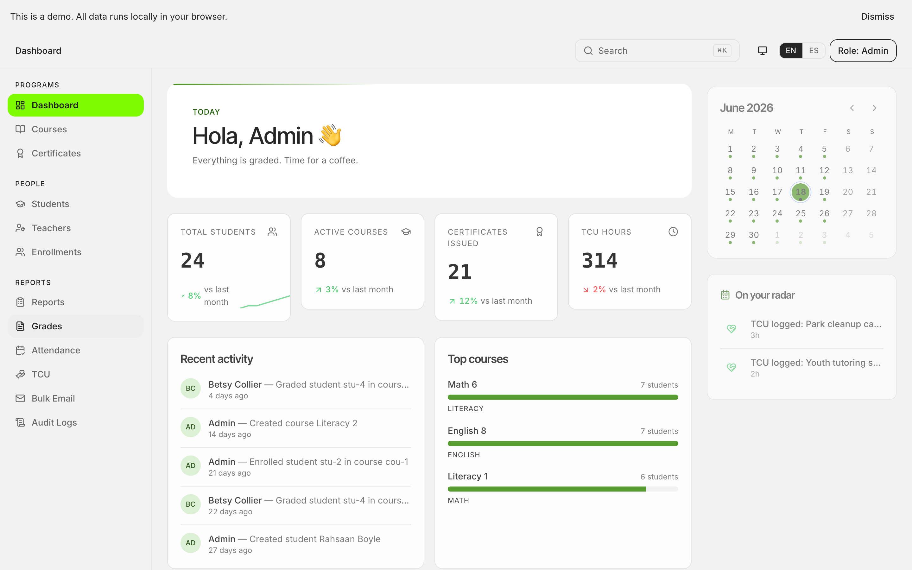
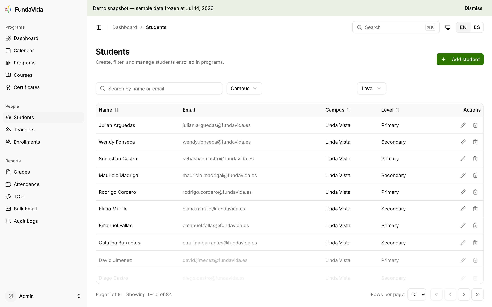
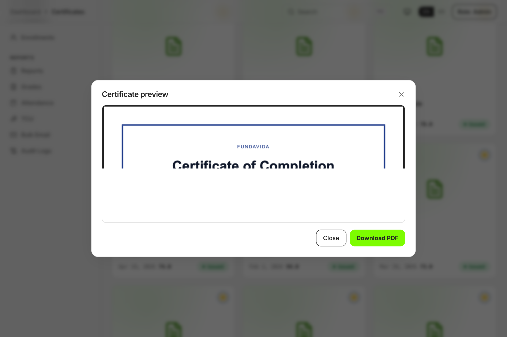
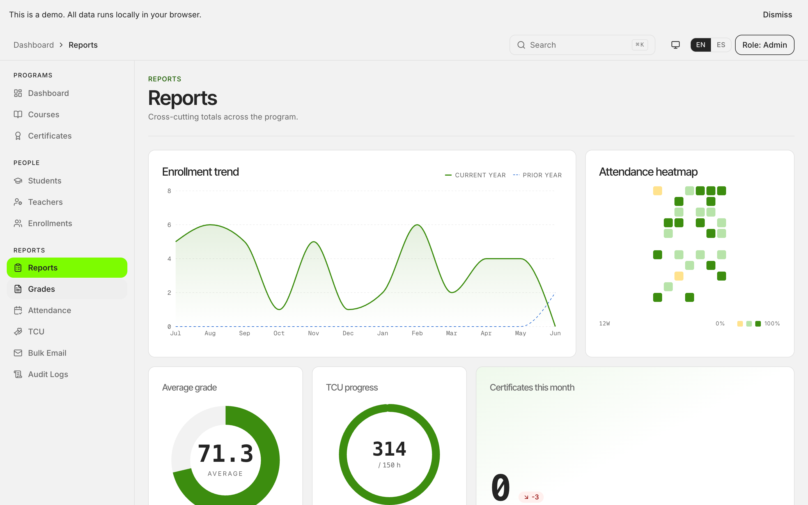
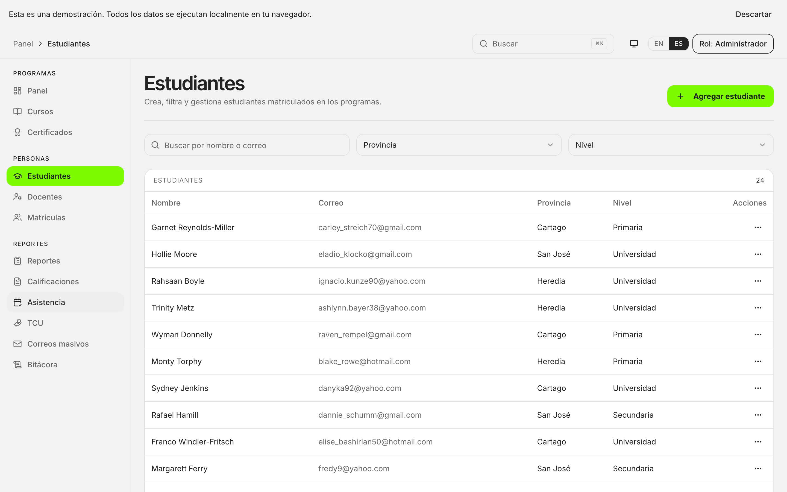

# FundaVida

> Educational management platform — rearchitected as a browser-only portfolio demo.

[](https://fundavida.vercel.app/)
[](https://github.com/rjwrld/FundaVida/actions)

FundaVida was a production educational-management platform built for a Costa Rican non-profit on React + Supabase. This repository is a **portfolio rearchitecture**: all data runs in your browser via `localStorage`, there is no backend, no auth, no secrets. The original platform's visual breadth is preserved; interactivity is deliberately tiered (full CRUD on hero modules, read-only showcase on others).

## Rearchitected from production

| Production (original)     | Portfolio demo (this repo)            |
| ------------------------- | ------------------------------------- |
| Supabase Auth + RLS       | Role switcher (no login)              |
| PostgreSQL + Storage      | Zustand + `localStorage`              |
| Resend email delivery     | Simulated (logged to the audit trail) |
| Vercel + Supabase hosting | Vercel only                           |
| Spanish-only UI           | Bilingual EN / ES (toggle top-right)  |

## Live demo

[](https://fundavida.vercel.app/)

## Stack

| Layer              | Technology                                       |
| ------------------ | ------------------------------------------------ |
| Framework          | React 18 · TypeScript (strict) · Vite            |
| Styling            | Tailwind CSS · shadcn/ui · Radix primitives      |
| State              | Zustand (persisted via `localStorage`)           |
| Data fetching      | TanStack Query                                   |
| Forms & validation | React Hook Form · Zod (t-bound factories)        |
| Routing            | React Router v6                                  |
| i18n               | react-i18next · i18next-parser (CI-gated)        |
| PDF                | @react-pdf/renderer                              |
| Testing            | Vitest · Testing Library · Playwright            |
| CI                 | GitHub Actions · Lighthouse CI · Vercel previews |

## Features by tier

### Per-role dashboards

Each role sees a customized dashboard on login reflecting their responsibilities:

- **Admin** — platform overview: total students, courses, certificates pending approval, attendance summary, bulk-email audit trail.
- **Teacher** — your courses, students enrolled in your courses, grades entered, sessions for this month.
- **Student** — your enrollments, grades you've received, certificates earned, your attendance record.
- **TCU Trainee** — your logged activities, hours completed toward the 300-hour requirement.

### Tier 1 — Hero modules (full CRUD + deep polish)

- **Students** — create, filter, search, edit, delete. Form validation with localized messages, optimistic updates, keyboard navigation, responsive layout.
- **Courses** — pair with students via enrollments; exercises relational state.
- **Certificates** — generate and download PDFs in-browser via `@react-pdf/renderer`. Approval workflow: pending → approved by admin → download enabled.

### Tier 2 — Supporting modules (basic CRUD)

- **Teachers** — referenced by courses.
- **Enrollments** — bridges students and courses.
- **Grades** — enter scores after course ends (70+ threshold makes a student eligible for a certificate).
- **Attendance** — mark per-Session presence/absence; Teacher marks within their courses, Admin globally.

### Tier 3 — Read-only showcase + Specialised workflows

- **Bulk Email** — draft, recipient filter preview, send (simulated, logged to audit).
- **Reports** — cross-cutting totals, averages, attendance rates, community hours.
- **Audit Logs** — every create/update/delete since the last demo reset.
- **TCU** — community-service trainees log activities (hours, title, date) in self-service portal; all role-scoped.

## Role × capability matrix

All access decisions flow through a single declarative matrix (see [ADR-0007](docs/adr/0007-permissions-are-one-declarative-matrix.md)). The table below shows which roles can perform which actions on each resource. **✓** = allowed; empty = denied.

| Resource         | Admin |  Teacher  | Student | TCU |
| ---------------- | :---: | :-------: | :-----: | :-: |
| **Students**     |       |           |         |     |
| — view           |   ✓   |    ✓\*    |    —    |  —  |
| — create         |   ✓   |     —     |    —    |  —  |
| — edit           |   ✓   |     —     |    —    |  —  |
| — delete         |   ✓   |     —     |    —    |  —  |
| **Teachers**     |       |           |         |     |
| — view           |   ✓   |     —     |    —    |  —  |
| — create         |   ✓   |     —     |    —    |  —  |
| — edit           |   ✓   |     —     |    —    |  —  |
| — delete         |   ✓   |     —     |    —    |  —  |
| **Courses**      |       |           |         |     |
| — view           |   ✓   |   ✓\*\*   |    ✓    |  —  |
| — create         |   ✓   |     —     |    —    |  —  |
| — edit           |   ✓   |     —     |    —    |  —  |
| — delete         |   ✓   |     —     |    —    |  —  |
| **Enrollments**  |       |           |         |     |
| — view           |   ✓   |   ✓\*\*   |    —    |  —  |
| — create         |   ✓   |     —     |    —    |  —  |
| — delete         |   ✓   |     —     |    —    |  —  |
| **Grades**       |       |           |         |     |
| — view           |   ✓   |     ✓     | ✓\*\*\* |  —  |
| — enter          |   ✓   | ✓\*\*\*\* |    —    |  —  |
| — edit           |   ✓   | ✓\*\*\*\* |    —    |  —  |
| — delete         |   ✓   |     —     |    —    |  —  |
| **Certificates** |       |           |         |     |
| — view           |   ✓   |     —     | ✓\*\*\* |  —  |
| — approve        |   ✓   |     —     |    —    |  —  |
| **Attendance**   |       |           |         |     |
| — view           |   ✓   |   ✓\*\*   | ✓\*\*\* |  —  |
| — mark           |   ✓   |   ✓\*\*   |    —    |  —  |
| **TCU**          |       |           |         |     |
| — view           |   ✓   |     —     |    —    |  —  |
| — log            |   ✓   |     —     |    —    | ✓†  |
| **Reports**      |       |           |         |     |
| — view           |   ✓   |     —     |    —    |  —  |
| **Bulk Email**   |       |           |         |     |
| — view           |   ✓   |     —     |    —    |  —  |
| — create         |   ✓   |     —     |    —    |  —  |
| **Audit Log**    |       |           |         |     |
| — view           |   ✓   |     —     |    —    |  —  |

**Scope annotations:**

- `*` Teacher sees students enrolled in their own courses only.
- `**` Teacher sees data only for courses they own.
- `***` Student sees only their own records.
- `****` Teacher may enter and edit grades only after their course's term ends.
- `†` TCU trainee can log activities for their own ID only (cannot log for other trainees).

See [src/permissions/matrix.ts](src/permissions/matrix.ts) for the authoritative source and [ADR-0008](docs/adr/0008-scopefor-returns-tokens-api-interprets.md) for how scopes are applied at read time.

## Scheduling & Demo Epoch

Courses are scheduled via two properties: **Term** (start and end dates) and **Meeting Days** (e.g. Mon/Wed). The app derives the **Session list** (individual class meetings) from these two at read time — Sessions are never stored, keeping the model simple and preventing drift (see [ADR-0001](docs/adr/0001-sessions-are-derived-never-stored.md)).

**Demo Epoch** (see [ADR-0002](docs/adr/0002-demo-epoch-is-seed-relative.md)): all seeded dates are positioned relative to the moment the demo loads in your browser. This ensures the demo always shows real upcoming Sessions and current "this month" metrics, never decaying as time passes. Return visitors' data slowly ages until they reset the demo.

See [CONTEXT.md](CONTEXT.md) for the complete domain vocabulary (Sede, Educational Level, TCU Trainee, etc.) and the `docs/adr/` directory for the architectural decisions behind each module.

## Screenshots


_Students module — CRUD with search, filters, form validation._


_Certificates module — PDF preview + download._


_Reports module — client-side aggregates._

### Bilingual in action

| English                                            | Español                                            |
| -------------------------------------------------- | -------------------------------------------------- |
|  |  |

Every module ships in both locales; `npm run i18n:check` fails CI on any missing translation.

## Getting started

```bash
git clone https://github.com/rjwrld/FundaVida.git
cd FundaVida
npm install
npm run dev
```

No environment variables required. The demo seeds deterministic data on first load (`faker.seed(42)`).

## Scripts

| Command                 | Description                                 |
| ----------------------- | ------------------------------------------- |
| `npm run dev`           | Start Vite dev server                       |
| `npm run build`         | Typecheck + production build                |
| `npm run typecheck`     | `tsc --noEmit`                              |
| `npm run lint`          | ESLint (zero warnings allowed)              |
| `npm run format`        | Prettier write                              |
| `npm run format:check`  | Prettier check (CI-gated)                   |
| `npm run i18n:extract`  | Extract translation keys via i18next-parser |
| `npm run i18n:check`    | Extract + diff; fails if locale files drift |
| `npm run test`          | Vitest (unit + component)                   |
| `npm run test:coverage` | Vitest with coverage report                 |
| `npm run e2e`           | Playwright end-to-end suite                 |
| `npm run e2e:ui`        | Playwright UI mode                          |
| `npm run screenshots`   | Regenerate landing + README screenshots     |

## Project structure

```
src/
├── App.tsx           # App shell & router
├── main.tsx          # Vite entry
├── components/
│   ├── landing/      # Landing-only components (hero, features, tech stack, footer)
│   ├── layout/       # Shared layout (header, sidebar, language toggle)
│   ├── ui/           # shadcn/ui primitives
│   └── [feature]/    # Feature-specific components
├── constants/        # Static configuration
├── data/
│   ├── api/          # Thin hooks atop @tanstack/react-query
│   ├── schemas/      # Zod schema factories (buildXSchema(t))
│   ├── seed/         # Deterministic faker.seed(42) generators
│   ├── persistence.ts # localStorage adapter
│   ├── debounce.ts   # Persistence debouncer
│   └── store.ts      # Zustand root store
├── hooks/            # Custom React hooks (useFormat, useCurrentUser, …)
│   └── api/          # Feature-scoped @tanstack/react-query hooks
├── lib/              # Format helpers, report builders, PDF templates
├── locales/          # en.json + es.json dictionaries + keys.ts parser hints
├── pages/            # Route-level components
└── types/            # Shared TS types
```

## Author

Built by **Josue Calderon** as a portfolio rearchitecture of a college project.

- LinkedIn: [linkedin.com/in/rjwrld](https://www.linkedin.com/in/rjwrld/)
- GitHub: [@rjwrld](https://github.com/rjwrld)

---

<details>
<summary><strong>Sobre FundaVida</strong> — en español</summary>

[**FundaVida**](https://www.fundavida.org/) es una organización sin fines de lucro que trabaja en comunidades de alto riesgo cerca de San José, Costa Rica: Concepción de Alajuelita, 25 de Julio y Linda Vista de Patarrá.

**Misión:** empoderar a jóvenes a través de programas galardonados para superar la violencia, la pobreza y la deserción escolar.

**Programas principales:**

- Centros de Cómputo Interactivos
- Inglés
- Jóvenes con Propósito
- Consejería
- Apoyo Educativo

Este repositorio es una **rearquitectura de portafolio** de una plataforma original construida con React + Supabase para FundaVida. Toda la data corre en tu navegador; no hay backend, ni autenticación, ni secretos. La interfaz está traducida al español y se puede alternar con el botón de idioma en la esquina superior derecha.

> "La esperanza lo cambia todo."

Visita [fundavida.org](https://www.fundavida.org/) para conocer cómo contribuir con donaciones, voluntariado o alianzas.

</details>
